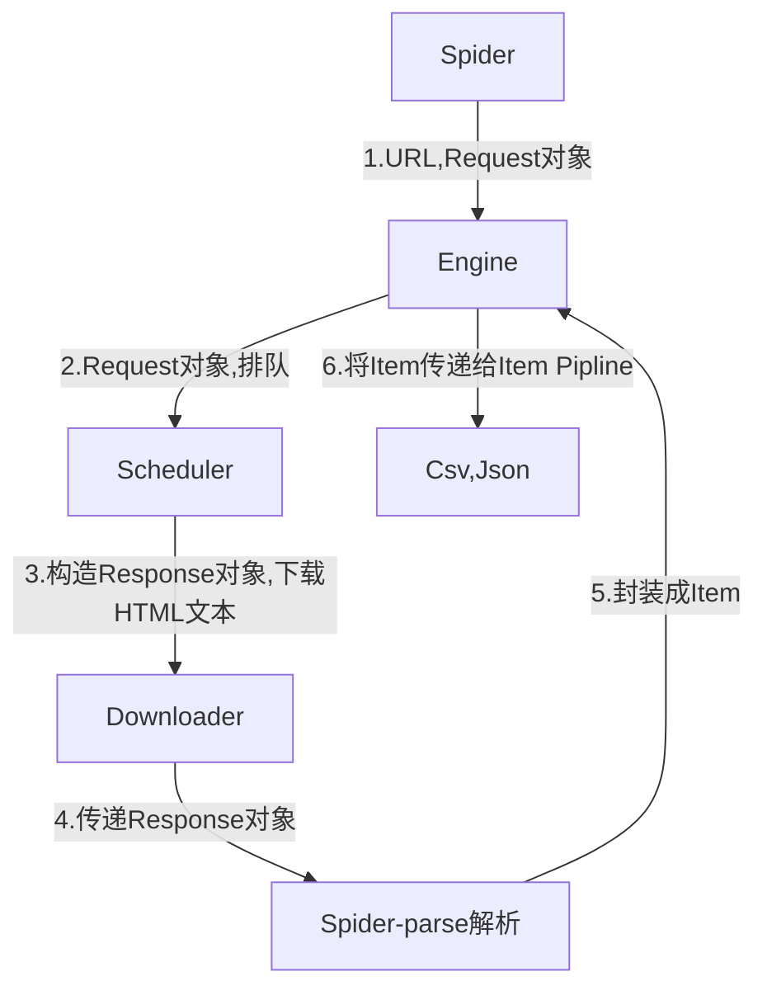

# 第1章 初始Scrapy
## 1.1 安装 
```shell
pip install -U scrapy
```
# 1.2 基本抓取流程
**$UR^2IM$**    
U: URL    
R: Request 请求    
R: Response 响应    
I: Item    
M: More URL 更多的url    

# 1.3 创建项目
```shell
scrapy startproject your_project_name
```
文件夹目录Tree    
your_project_name    
- spiders
  - __init__.py
- __init__.py
- middlewares.py
- pipeline.py
- settings.py
- scrapy.cfg

# 1.4 自定义继承爬虫类
在spiders的目录下创建my_spider.py文件
```Python
import scrapy

class MySpider(scrapy.Spider):
    name="MyOnlyID"  # 是唯一标识，一个项目中不允许存在同名的爬虫
    start_urls = ['http://books.toscrape.com']  # 起始爬虫点
    def parse(self, response):  # 页面下载完成后，Scrapy引擎会回调一个指定的页面解析函数(默认为parse方法)
        pass
```

# 第2章 Scrapy 
## 2.1 Scrapy框架结构及工作原理

框架组件：    
   
|组件|描述|类型|
|:--:|:--:|:--:|
|Engine|引擎，框架的核心，其他所有组件在其控制下工作|内部组件|
|Scheduler|调度器，负责对Spider提交的下载请求进行调度|内部组件|
|Downloader|下载器，负责下载页面(发送HTTP请求/接收HTTP响应)|内部组件|
|Spider|爬虫，负责提取页面的数据，并产生对新页面的下载请求|用户实现|
|Middleware|中间件，负责对Request和Response对象进行处理|可选组件|
|Item Pipline|数据管道，负责对爬取到的数据进行处理|可选组件|

框架数据流：

|对象|描述|
|:--:|:--:|
|Request|请求对象|
|Response|响应对象|
|Item|从页面中爬取的一项数据|



更形象的类比描述：框架的组件比作人体的各个器官，Request和Response对象便是血液，Item则是代谢产物。    

## 2.2 Request和Response对象
**Request(url[, callback, method='GET', headers, body, cookies, meta, encoding='utf-8', priority=0, dont_filter=False, errback])**    
Request: 
- url: 必选，请求页面的地址，bytes或str。
- callback: 页面的解析函数，Callable类型， Request对象请求的页面下载完成后，由该参数指定的页面解析函数被调用。如果未传递该参数，默认调用Spider的parse方法。
- method: HTTP请求的方法，默认为 'GET'。
- headers: HTTP请求的头部字典，dict类型，如{'Accept':'text/html','User-Agent':'Mozilla/5.0'}。如果其中某项的值为None，就表示不发送该项HTTP头部，如{'Cookie':None}，禁止发送Cookie。
- body: HTTP请求的正文，bytes或str类型。
- cookies: Cookie信息字典，dict类型，例如{'currency': 'USD', 'country':'UY'}。
- meta: Request的元数据字典，dict类型，用于给框架中其他组件传递信息，比如中间件Item Pipeline。其他组件可以使用Request对象的meta属性访问该元数据字典（request.meta）​，也用于给响应处理函数传递信息，详见Response的meta属性。
- encoding: url和body参数的编码默认为'utf-8'。如果传入的url或body参数是str类型，就使用该参数进行编码。
- priority: 请求的优先级默认值为0，优先级高的请求优先下载。
- dont_filter: 默认情况下（dont_filter=False）​，对同一个url地址多次提交下载请求，后面的请求会被去重过滤器过滤（避免重复下载）​。如果将该参数置为True，可以使请求避免被过滤，强制下载。例如，在多次爬取一个内容随时间而变化的页面时（每次使用相同的url）​，可以将该参数置为True。
- errback: 请求出现异常或者出现HTTP错误时（如404页面不存在）的回调函数。

除url外，其他都是默认参数。如：
```Python
import scrapy
request = scrapy.Request('http://books.toscrape.com')
request2 = scrapy.Request('http://quotes.toscrape.com')
```

**Response**的不同类型的子类    
- TextResponse
- HtmlResponse
  - url: HTTP响应的url地址，str类型。
  - status: HTTP响应的状态码，int类型，例如200，404。
  - headers: HTTP响应的头头部，类字典类型，可以调用get或getlist方法对其进行访问, 如 `response.headers.get('Content-Type')` `response.headers.getlist('Set-Cookie')` 。
  - body: HTTP响应正文，bytes类型。
  - text: 文本形式的HTTP响应正文，str类型，它是由response.body使用response.encoding解码得到的，即 `reponse.text=response.body.decode(response.encoding)`
  - encoding: HTTP响应正文的编码，它的值可能是从HTTP响应头部或正文中解析出来的。
  - request: 产生该HTTP响应的Request对象。
  - meta: 即response.request.meta，在构造Request对象时，可将要传递给响应处理函数的信息通过meta参数传入；响应处理函数处理响应时，通过response.meta将信息取出。
  - selector: Selector对象用于在Response中提取数据​。
  - **xpath(query)**: 使用XPath选择器在Response中提取数据，实际上它是response.selector.xpath方法的快捷方式。
  - **css(query)**: 使用CSS选择器在Response中提取数据，实际上它是response.selector.css方法的快捷方式。
  - **urljoin(url)**: 用于构造绝对url。当传入的url参数是一个相对地址时，根据response.url计算出相应的绝对url。
- XmlResponse

HtmlResponse和XmlResponse是TextResponse的子类。
 
## 2.3 Spider的开发流程

开发流程
1. 继承scrapy.Spider
2. 为Spider取名
3. 设定起始爬取点
4. 实现页面解析函数

Spider基类的start_requests创建Request对象。
```Python
class Spider(object_ref):
    ···
    def start_requests(self):
        for url in self.start_urls:
            yield self.make_requests_from_url(url)

    def make_requests_from_url(self, url):
        return Request(url,dont_filter=True)

    def parse(self, response):
        raise NotImplementdError
```
因此如果要自定义请求，可以通过覆盖基类的 start_requests 方法来实现。 如下：
```Python
class MySpider(spider.Spider):
    def start_requests(self):
        yield scrapy.Request('http://books.toscrape.com/',callback=self.parse_book, headers={'User-Agent': 'Mozilla/5.0'}, dont_filter=True)

    def parse_book(response):
        pass
```

# 第3章 使用Selector提取数据
## 3.1 Selector对象
HTTP文本解析模块：
- BeautifulSoup
- lxml

Scrapy基于lxml构建，简化了API,实现了Selector类。    

选中数据(Selector/SelectorList)：
- xpath
- css

提取数据:
- extract
- re
- extract_first (SelectorList专有)
- re_first (SelectorList专有)

```Python
from scrapy.selector import Selector
from scrapy.http import HtmlResponse

text ='<html><body><h1>Hello World</h1> <h1>Hello Scrapy</h1><b>Hello Python</b><ul><li>C++</li><li>Java</li><li>Python</li></ul></body></html>'
# 文本
selector = Selector(text=text)

# response响应对象
response = HtmlReponse(url='http://www.example.com',body=text,encoding='utf-8')
selector = Selecotr(response=text)

selector_list = selector.xpath('//h1')
```


## 3.2 Response内置Selector

源码如下：
```
class TextResponse(Response):
    def __init__(self, *args, **kwargs):
        ...
        self._cached_selector=None
        ...

    @property
    def selector(self):
        from scrapy.selector import Selector
        if self._cached_selector is None:
            self._cached_selector = Selector(self)
        return self._cached_selector

    def xpath(self, query, **kwargs):
        return self.selector.xpath(query, **kwargs)

    def css(self, query):
        return self.selector.css(query)
```
 
使用非常简单：
```Python
response.xpath('.//h1/text()').extract()
response.css('li::text').extract()
```

## 3.3 XPath
XPath: XML路径语言(XML Path Language)

xml文档的节点有多种类型，常见如下：
- 根节点 整个文档树的根。
- 元素节点 html body div p a
- 属性节点 href
- 文本节点 cancel confirm

节点间的关系：
- 父子 body是html的子节点，p和a是div的子节点。反过来，div是p和a的父节点。
- 兄弟 p和a为兄弟节点
- 祖先/后裔 body、div、p、a都是html的后裔节点；反过来html是它们的祖先节点

XPath常用的基本语法：

|表达式|描述|例子|
|:--:|:--:|:--:|
|/|选中文档的根(root)| 选中一个从根节点的绝对路径: response.xpath('/html')<br/>选中div子节点中的所有a: response.xpath('/html/body/div/a')|
|.|选中当前节点|选中第1个a下面的img: response.xpath('//a[1]/.//img')|
|..|选中当前节点的父节点|选中所有img的父节点: response.xpath('//img/..')|
|Element|选中子节点所有Element元素节点|
|//Element|选中后代节点中所有Element元素节点|选中文档中所有的a: response.xpath('//a')<br/>选中body后代中的所有img: response.xpath('/html/body//img')|
|*|选中所有元素子节点|选中html所有元素子节点: response.xpath('/html/*')<br/>选中div的所有后代元素节点: response.xpath('/html/body/div//*')<br/>选中div孙节点的所有img: response.xpath('//div/*/img')|
|text()|选中所有文本子节点|选中所有a的文本: response.xpath('//a/text()')|
|@Attr|选中名为Attr的属性节点|选中所有img的src属性: response.xpath('//img/@src')<br/>选中文档中所有href属性: response.xpath('//@href')|
|@*|选中所有属性节点|获取第一个a下img的所有属性: response.xpath('//a[1]/img/@*')|
|[谓语]|谓语用来查找某个特定的节点或包含某个特定值的节点|选中所有a中的第3个: response.xpath('//a[3]')<br/>使用last函数，选中最后1个: response.xpath('//a[last()]')<br/>使用position函数，选中前3个: response.xpath('//a[position()<=3]')<br/>选中所有含有id属性的div: response.xpath('//div/[@id]')<br/>选中所有含id属性且值为“images”的div: response.xpath('//div[@id="images"]')|

常用函数:     
- string(arg): 返回参数的字符串值 `response.xpath('/html/body/a/strong/text()').extract()` = `response.xpath('string(/html/body/a/strong)').extract()`
- contains(str1, str2): 判断str1中是否包含str2，返回布尔值 `response.xpath('//p[contians(@class 'info')]')`

## 3.4 CSS选择器
css选择语法简单，其内部会使用Python库cssselect将css转换成xpath表达式。

CSS常用的基本语法

|表达式|描述|例子|详例|
|:--:|:--:|:--:|:--:|
|*|选中所有元素|*||
|E|选中E元素|p|选中所有的img: response.css('img')|
|E1,E2|选中E1和E2|div,pre|选中所有的base和title: response.css('base,title')|
|E1 E2|选中E1后代元素中的E2元素|div p|选中div后代中的img: response.css('div img')|
|E1>E2|选中E1元素中的E2元素|div>p|选中body子元素中的div: response.css('body>div')|
|E1+E2|选中E1兄弟元素中E2元素|p+strong||
|.Class|选中Class属性包含Class的元素|.info||
|#ID|选中id属性ID的元素|#main||
|[Attr]|选中包含Attr属性的元素|[href]|选中包含style属性的元素: response.css('[style]')|
|[Attr=Value]|选中包含Attr属性且值为Value的元素|[method=post]|选中属性id值为images-1的元素: response.css('[id=image-1]')|
|[Attr~=Value]|选中包含Attr属性且值包含Value的元素|[class~=clearfix]||
|E:nth-child(n)<br/>E:nth-last-child(n)|选中E元素，且该元素必须是其父元素的(倒数)第n个子元素|a:nth-child(1)<br/>a:nth-last-child(2)|选中每个div的第1个a: response.css('div>a:nth-child(1)')<br/>选中第二个div的第一个a: response.css('div:nth-child(2)>a:nth-child(1)')|
|E:first-child<br/>E:last-child|选中E元素，且该元素必须是其父元素的(倒数)第一个子元素|a:first-child<br/>a:last-child|选中第1个div中的最后一个a: response.css('div:first-child>a:last-child')|
|E:empty|选中没有子元素的E元素|div:empty||
|E::text|选中E元素的文本节点(TextNode)|p::text|选择所有a的文本: response.css('a::text')|

# 第4章 使用Item封装数据
用字典包装难以一目了然数据中包含哪些字段，影响代码可读性。

```Python
from scrapy import Item, Field
class BookItem(Item):
    name = Field()
    price = Field()
```

# 第5章 使用Item Pipeline处理数据
Item Pipeline的几种典型应用:
- 清晰数据
- 验证数据的有效性
- 过滤掉重复的数据
- 将数据存入数据库

在pipelines.py文件中，实现如下内容:
```Python
class PriceConverterPipeline(object):
    exchange_rate = 7.16
    def process_item(self, item, spider):
        price = float(item['price'][1:]) * self.exchange_price
        item['price'] = '￥ %.2f' % price
        return item
```
一个Item Pipeline不需要继承特定基类，只需要实现某些特定的方法，如 
- process_item(self, item, spider)
- open_spider(self, spider)  可选，spider打开时处理数据前回调方法，通常处理数据之前完成某些初始化工作，如连接数据库
- close_spider(self, spider)  可选，spider关闭时处理数据后回调方法，通常处理完成所有数据之后完成某些清理工作，如关闭数据库
- from_crawler(cls, crawler)  可选，创建Item Pipeline对象回调该类方法。该方法通过crawler.settings读取配置，根据配置创建Item Pipeline对象

启用自定义的Item Pipeline, 通过配置settings.py
```Python
ITEM_PIPELINES = {
    'your_project_name.pipelines.PriceConverterPipeline': 300,
}
```

关于from_crawler使用代码示例
```Python
from scrapy.item import Item
import pymongo

class MongoDBPipeline(object):

    @classmethod
    def from_crawler(cls, crawler):
        cls.DB_URL = crawler.settings.get('MONGO_DB_URI','mongodb://localhost:27107/')
        cls.DB_NAME = crawler.settings.get('MONGO_DB_NAME', 'scrapy_data')
        return cls()

    def open_spider(self, spider):
        self.client = pymongo.MongoClient(self.DB_URI)
        self.db = self.client[self.DB_NAME]

    def close_spider(self, spider):
        self.client.close()

    def process_item(self, item, spider):
        collection = self.db[spider.name]
        post = dict(item) if isinstance(item, Item) else item
        collection.insert_one(post)
        return item

# 在settings.py中配置所要使用的数据库进行设置
# MONGO_DB_URI = 'mongodb://192.168.1.105:27017/'
# MONGO_DB_NAME = 'liushuo_scrapy_data'

# 配置
# ITEM_PIPELINES = {
#     'your_project_name.pipelines.MongoDBPipeline': 300,
# }
```

# 第6章 使用LinkExtractor提取链接
```Python
from scrapy.linkextractors import LinkExtractor

# 提取链接
# next_url = response.css('ul.pager li.next a::attr(href)').extract_first()
le = LinkExtractor(restrict_css='ui.paper li.next')
links = le.extract_links(response)
```
LinkExtractor均有默认参数，参数说明：
- allow: 接受一个正则表达式或一个正则表达式列表，参数为空则提取全部链接。
- deny: 与allow相反，排除与正则表达式匹配的链接。
- allow_domains: 接受一个域名或一个域名列表，提取到指定域的链接。
- deny_domains: 与allow_domains相反，排除指定域的链接。
- restrict_xpaths: 接受一个XPath表达式或一个XPath表达式列表，提取XPath表达式选中区域下的链接。
- restrict_css: 接受一个css选择器或一个css选择器列表，提取css选择器选中区域下的链接。
- tags: 接受一个标签(字符串)或一个标签列表，提取指定标签内的链接，默认['a','area']
- attrs: 接受一个属性(字符串)或一个属性列表，提取指定属性内的链接，默认为['href']
- process_value: 接受一个func(value)的回调函数。如果传递该参数，LinkExtractor将调用回调函数对提取的每一个链接(如a的href)进行处理，回调函数正常情况下应返回一个字符串(处理结果)，想要抛弃所处理的链接时，返回None。

# 第7章 使用Exporter导出数据
Export导出器支持的数据格式：
- **JSON(JsonItemExporter)**
- **JSON lines(JsonLinesItemExporter)**
- **CSV(CsvItemExporter)**
- **XML(XmlItemExporter)**
- Pickle(PickleItemExporter)
- Marshal(MarshalItemExporter)

## 7.1 指定如何导出数据

命令行:    
`scrapy crawl spider_name -o 文件路径 -t 数据格式` 或 `scrapy crawl spider_name -o 文件路径.csv`    
指定导出文件路径时：    
- %(name)s: 会被替换成Spider里定义的name的名字
- %(time)s: 会被替换成文件创建时间

`scrapy crawl books -o 'export_data/%(name)s/%(time)s.csv'`


配置(settings):    
```
# 框架内部支持的数据格式
# FEED_EXPORTERS_BASE = {
#    'json': 'scrapy.exporters.JsonItemExporter',
#    'jsonlines': 'scrapy.exporters.JsonLinesItemExporter',
#    'jl': 'scrapy.exporters.JsonLinesItemExporter',
#    'csv': 'scrapy.exporters.CsvItemExporter',
#    'xml': 'scrapy.exporters.XmlItemExporter',
#    'marshal': 'scrapy.exporters.MarshalItemExporter',
#    'pickle': 'scrapy.exporters.PickleItemExporter',
# }


# 指定导出文件路径
FEED_URI = 'export_data/%(name)s_%(time)s.data'

# 指定导出的数据格式
FEED_FORMAT = 'csv'

# 导出文件编码
FEED_EXPORT_ENCODING = 'utf-8'

# 导出数据包含的字段(默认情况下导出所有字段)，并指定次序
FEED_EXPORT_FIELDS = ['name', 'author', 'price']

# 用户自定义支持的数据格式
# FEED_EXPORTERS = {'excel': 'my_project.my_exporters.ExcelItemExporter'}
```

**自定义实现Exporter**，创建my_exporters.py(与settings.py同级目录),代码如下
```Python
from scrapy.exporters import BaseItemExporter
import xlwt

class ExcelItemExporter(BaseItemExporter):
    def __init__(self, file, **kwargs):
        self._configure(kwargs)
        self.file = file
        self.wbook = xlwt.Workbook()
        self.wsheet = self.wbook,add_sheet("scrapy")
        self.row = 0

    def finish_exporting(self):
        self.wbook.save(self.file)

    def export_item(self, item):
        fields = self._get_serialized_fields(item)
        for col, v in enumerate(x for _, x in fields):
            self.wsheet.write(self.row, col, v)
        self.row += 1
```
现在，需要在settings.py配置 
```Python
# 用户自定义支持的数据格式
FEED_EXPORTERS = {'excel': 'my_project.my_exporters.ExcelItemExporter'}
```


