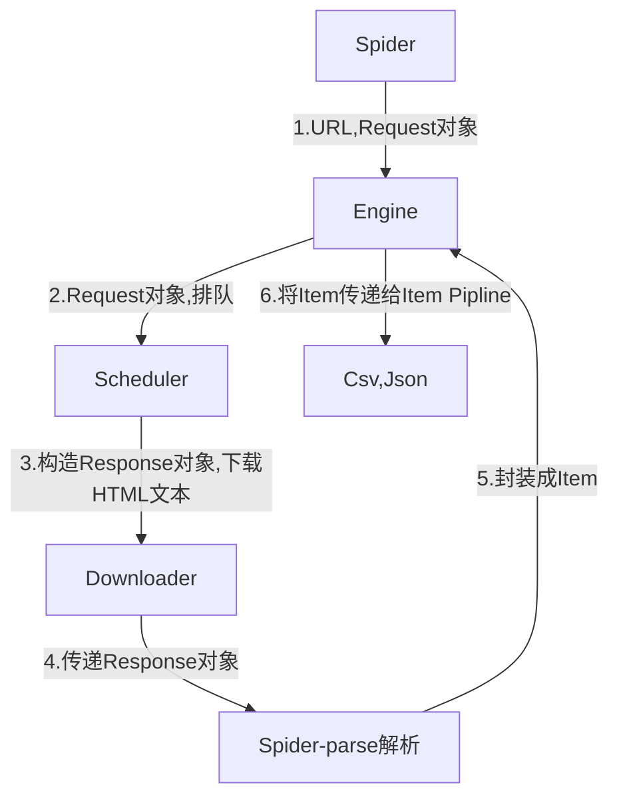

# 第1章 初始Scrapy
## 1.1 安装 
```shell
pip install -U scrapy
```
# 1.2 基本抓取流程
**$UR^2IM$**    
U: URL    
R: Request 请求    
R: Response 响应    
I: Item    
M: More URL 更多的url    

# 1.3 创建项目
```shell
scrapy startproject your_project_name
```
# 1.4 自定义继承爬虫类
在spiders的目录下创建my_spider.py文件
```Python
import scrapy

class MySpider(scrapy.Spider):
    name="MyOnlyID"  # 是唯一标识，一个项目中不允许存在同名的爬虫
    start_urls = ['http://books.toscrape.com']  # 起始爬虫点
    def parse(self, response):  # 页面下载完成后，Scrapy引擎会回调一个指定的页面解析函数(默认为parse方法)
        pass
```

# 第2章 Scrapy 
## 2.1 Scrapy框架结构及工作原理

框架组件：    
   
|组件|描述|类型|
|:--:|:--:|:--:|
|Engine|引擎，框架的核心，其他所有组件在其控制下工作|内部组件|
|Scheduler|调度器，负责对Spider提交的下载请求进行调度|内部组件|
|Downloader|下载器，负责下载页面(发送HTTP请求/接收HTTP响应)|内部组件|
|Spider|爬虫，负责提取页面的数据，并产生对新页面的下载请求|用户实现|
|Middleware|中间件，负责对Request和Response对象进行处理|可选组件|
|Item Pipline|数据管道，负责对爬取到的数据进行处理|可选组件|

框架数据流：

|对象|描述|
|:--:|:--:|
|Request|请求对象|
|Response|响应对象|
|Item|从页面中爬取的一项数据|



更形象的类比描述：框架的组件比作人体的各个器官，Request和Response对象便是血液，Item则是代谢产物。    

## 2.2 Request和Response对象
**Request(url[, callback, method='GET', headers, body, cookies, meta, encoding='utf-8', priority=0, dont_filter=False, errback])**    
Request: 
- url: 必选，请求页面的地址，bytes或str。
- callback: 页面的解析函数，Callable类型， Request对象请求的页面下载完成后，由该参数指定的页面解析函数被调用。如果未传递该参数，默认调用Spider的parse方法。
- method: HTTP请求的方法，默认为 'GET'。
- headers: HTTP请求的头部字典，dict类型，如{'Accept':'text/html','User-Agent':'Mozilla/5.0'}。如果其中某项的值为None，就表示不发送该项HTTP头部，如{'Cookie':None}，禁止发送Cookie。
- body: HTTP请求的正文，bytes或str类型。
- cookies: Cookie信息字典，dict类型，例如{'currency': 'USD', 'country':'UY'}。
- meta: Request的元数据字典，dict类型，用于给框架中其他组件传递信息，比如中间件Item Pipeline。其他组件可以使用Request对象的meta属性访问该元数据字典（request.meta）​，也用于给响应处理函数传递信息，详见Response的meta属性。
- encoding: url和body参数的编码默认为'utf-8'。如果传入的url或body参数是str类型，就使用该参数进行编码。
- priority: 请求的优先级默认值为0，优先级高的请求优先下载。
- dont_filter: 默认情况下（dont_filter=False）​，对同一个url地址多次提交下载请求，后面的请求会被去重过滤器过滤（避免重复下载）​。如果将该参数置为True，可以使请求避免被过滤，强制下载。例如，在多次爬取一个内容随时间而变化的页面时（每次使用相同的url）​，可以将该参数置为True。
- errback: 请求出现异常或者出现HTTP错误时（如404页面不存在）的回调函数。

除url外，其他都是默认参数。如：
```Python
import scrapy
request = scrapy.Request('http://books.toscrape.com')
request2 = scrapy.Request('http://quotes.toscrape.com')
```

**Response**的不同类型的子类    
- TextResponse
- HtmlResponse
  - url: HTTP响应的url地址，str类型。
  - status: HTTP响应的状态码，int类型，例如200，404。
  - headers: HTTP响应的头头部，类字典类型，可以调用get或getlist方法对其进行访问, 如 `response.headers.get('Content-Type')` `response.headers.getlist('Set-Cookie')` 。
  - body: HTTP响应正文，bytes类型。
  - text: 文本形式的HTTP响应正文，str类型，它是由response.body使用response.encoding解码得到的，即 `reponse.text=response.body.decode(response.encoding)`
  - encoding: HTTP响应正文的编码，它的值可能是从HTTP响应头部或正文中解析出来的。
  - request: 产生该HTTP响应的Request对象。
  - meta: 即response.request.meta，在构造Request对象时，可将要传递给响应处理函数的信息通过meta参数传入；响应处理函数处理响应时，通过response.meta将信息取出。
  - selector: Selector对象用于在Response中提取数据​。
  - **xpath(query)**: 使用XPath选择器在Response中提取数据，实际上它是response.selector.xpath方法的快捷方式。
  - **css(query)**: 使用CSS选择器在Response中提取数据，实际上它是response.selector.css方法的快捷方式。
  - **urljoin(url)**: 用于构造绝对url。当传入的url参数是一个相对地址时，根据response.url计算出相应的绝对url。
- XmlResponse

HtmlResponse和XmlResponse是TextResponse的子类。
 


 
