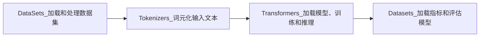

# 第2章 文本分类
文本分类是NLP中最常见的任务之一。        
情感分析，旨在确定给定文本的积极性。      

```mermaid
graph LR
A[DataSets_加载和处理数据集] --> B[Tokenizers_词元化输入文本]
B--> C[Transformers_加载模型、训练和推理]
C --> D[Datasets_加载指标和评估模型]
```

## 2.1 数据集

