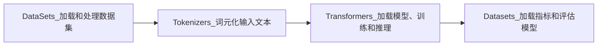

# 第2章 文本分类
文本分类是NLP中最常见的任务之一。        
情感分析，旨在确定给定文本的积极性。      

## 2.1 数据集
1. 数据集
2. 将文本转换成词元  
    2.1 字符词元化
    > 最简单的词元化方案是按每个字符单独馈送到模型中。
    > 数值化: 每个字符转换为一个整数，
    2.2 单词词元化
    > 词表太大是个问题，意味着训练成本高昂，模型更难维护
    2.3 子词词元化
    > 将字符和单词词元化的优点结合起来。
3. 训练文本分类器
   使用Transformers作为特征提取器
