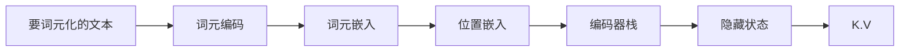
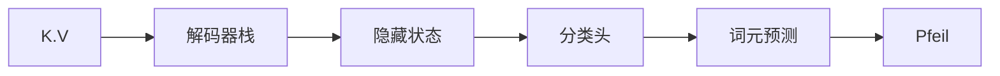

# 第3章 Transformer架构剖析
## 3.1 Transformer架构
组成：
- 编码器：将一个词元的输入序列转化成一系列嵌入向量，通常被称为隐藏状态或上下文。
- 解码器：利用编码器的隐藏状态，逐步生成一个词元的输出序列，每次生成一个词元。

编码器步骤


解码器步骤


Transformer架构的特性：
- 输入的文本转换成词元嵌入。由于注意力机制不了解词元之间的相对位置，因此需要注入位置信息，以便模拟文本的顺序性质。即词元嵌入会与包含每个词元位置信息的位置嵌入进行组合。
- 编码器由一系列编码器层或“块”堆叠而成，类似于计算机视觉中叠加卷积层。解码器亦是如此，由一系列解码器堆叠而成。
- 编码器的输出被提供给每个解码器层，随后解码器生成一个对于序列中下一个最可能的词元的预测，以此类推，直到达到特殊的结束序列EOS词元。

Transformer模型的三种类型:
- 纯编码器：该类模型将文本输入序列转化成富数字表示的形式，非常适合用于文本分类或命名实体识别等任务。此架构中为给定词元计算的表示取决于左侧(词元之前)和右侧(词元之后)上下文。通常称为双向注意力。 BERT极其变体属于该模型
- 纯解码器：该类模型将通过迭代预测最可能得下一个词来自动完成这个序列。在这种架构中，对于给定词元计算出来的表示仅依赖于左侧的上下文。这通常称为因果或自回归注意力。GPT模型家族属于该模型
- 编码器-解码器：用于对一个文本序列到另一个文本序列的复杂映射进行建模。它们适用于机器翻译和摘要任务。除了Transformer架构，它将编码器和解码器相结合，BART和T5模型也属于这个类。

## 3.2 编码器
编码器模块
```
X1 -->             --> 前馈  ==> Y1
X2 -->             --> 前馈  ==> Y2
X3 --> 多头自注意力 --> 前馈  ==> Y3
X4 -->             --> 前馈  ==> Y4 
X5 -->             --> 前馈  ==> Y5
```

1. 自注意力机制
> 注意力机制是一种神经网络为序列中的每个元素分配不同**权重**或“**注意力**”的机制。
> 自注意力中的“自”指的是这些权重是针对同一组隐藏状态计算的。
> 自注意力的主要思想是，不是使用固定的嵌入值来表示每个词元，而是使用整个序列来计算每个嵌入值的加权平均值。
> 另一种表述，给定词元嵌入的序列 $x_1$ , ··· , $x_n$ ,自注意力机制产生新的嵌入序列 $x^{'}_{1}$ , ··· , $x^{'}_n$ , 其中每个 $x^{'}_i$ 是所有 $x_j$ 的线性组合:
>
> $$
> x_{i}^{'} = \sum_{j=1}^{n}w_{ji}x_j
> $$
>
> 其中的系数 $w_{ji}$ 注意力权重，其被规范化以使得 $\sum_jw_{ji} = 1$。
>
> 注意力权重如何计算
> - 缩放点积注意力
>   1. 将每个词元投影到三个向量中，分别称为query、key和value。
>   2. 计算注意力分数。使用相似度函数确定query和key向量的相关程度。缩放点积注意力的相似度函数是点积，并通过嵌入的矩阵乘法高效计算。相似的query和key将具有较大的点积，而没有相似的几乎没有重叠。注意力分数，在一个有n个输入词元的序列中，对应nxn的注意力矩阵。
>   3. 计算注意力权重。把注意力分数乘以一个缩放因子来规范化它们的方差，然后再通过softmax进行规范化，以确保所有列的值相加之和为1. 结果得到一个nxn的矩阵，该矩阵包含了所有的注意力权重 $w_{ji}$
>   4. 更新词嵌入。计算完注意力权重之后，我们将它们与值向量 $v_{1}$ , ··· , $v_n$ 相乘，最终获得词嵌入表示
>   
> $$
> x_{i}^{'} =\sum_jw_{ji}v_{j}
> $$
> ```mermaid
> graph LR
>     A[Q] --> B[矩阵乘法]
>     C[K] --> B
>     B --> D[缩放]
>     D --> E[掩码_可选]
>     E --> F[Softmax]
>     F --> G[矩阵乘法]
>     H[V] --> G
> ```
>
> |PyTorch|创建或实现了|
> |:--:|:--:|
> |nn.Linear|密集神经网络层|
> |nn.Module|模型的构建块|
> |nn.Dropout|dropout层|
> |nn.LayerNorm|层规范化|
> |nn.Embedding|嵌入层|
> |nn.GELU|高斯误差线性单元激活函数|
> |nn.bmm|批量矩阵乘法|
> |model.foward|模型的前向传递过程|
>
> 多头注意力     
> 


