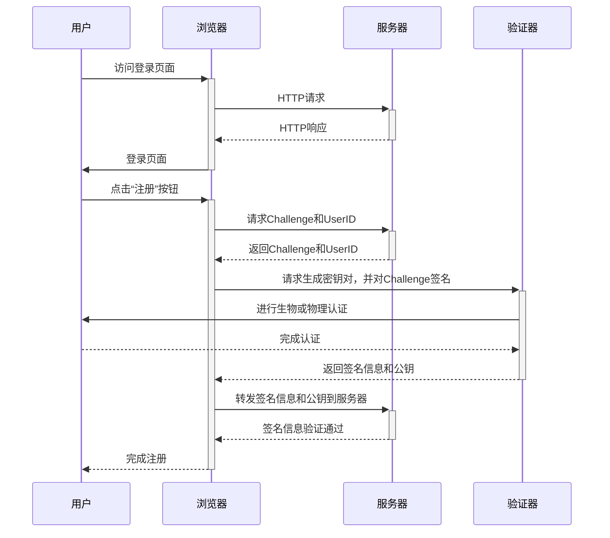
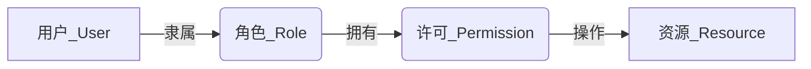
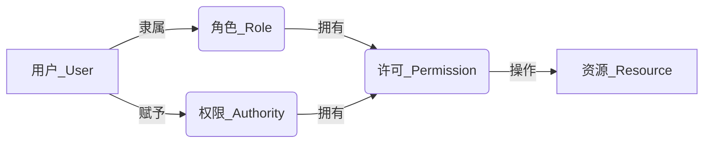
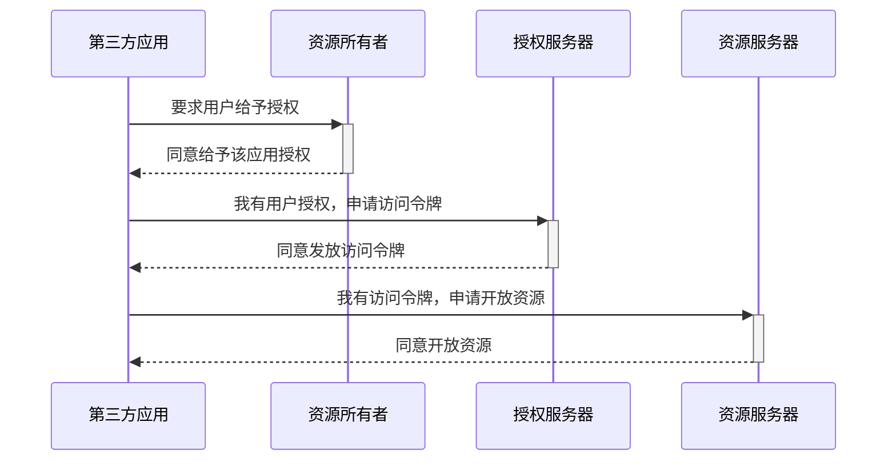
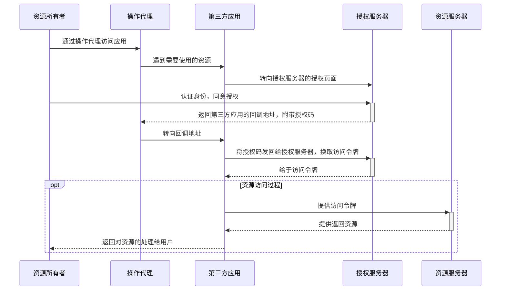
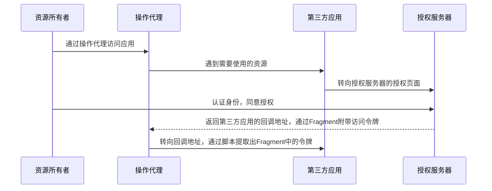
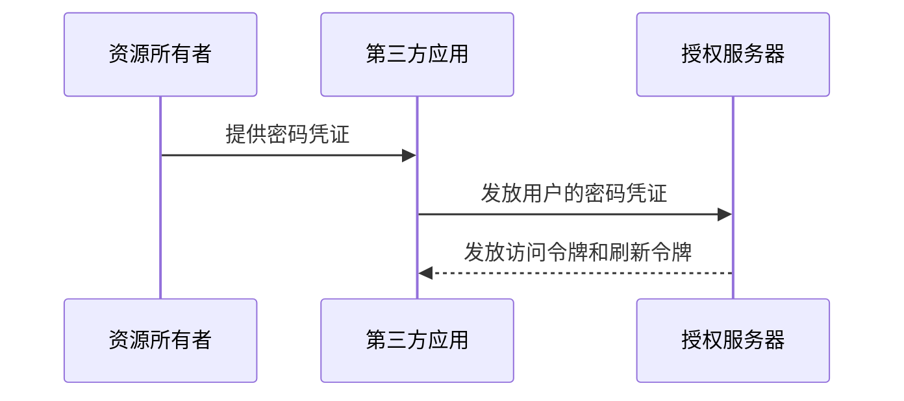
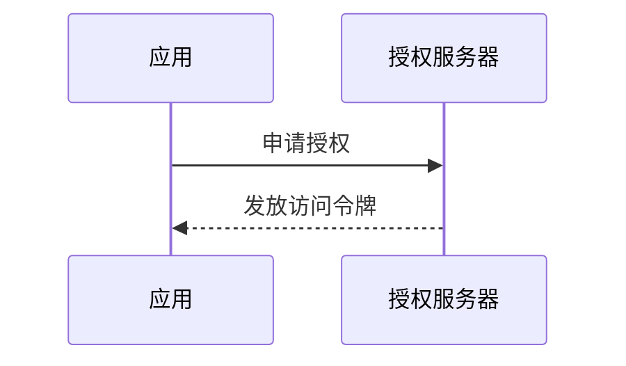
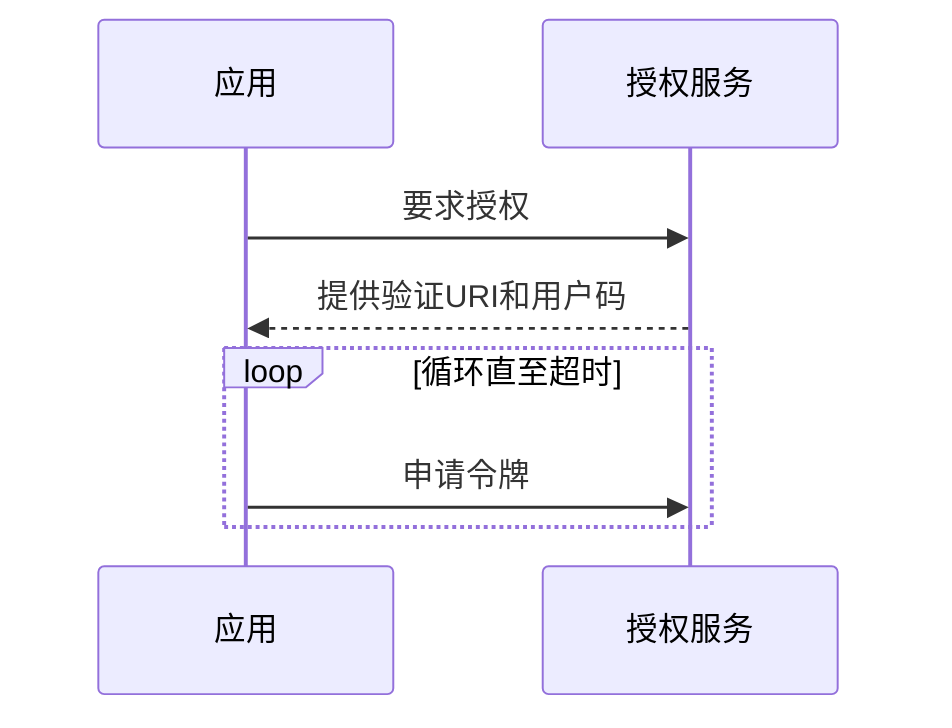
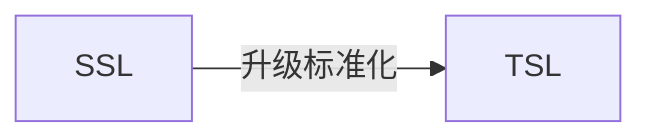

围绕业务能力构建，康威定律，有怎样结构、规模、能力的团队，就会产生对应结构、规模、能力的产品。这个结论是必然的演化结果。

产品化思维。避免把软件研发视作要去完成某种功能，而是视作一种持续改进、提升的过程。

技术架构者的第一职责就是决策权衡，有利有弊才需要决策，有取有舍才需要权衡，如果架构者本身的知识面不足以覆盖所需要决策的内容，不清楚其中利弊，恐怕将无可避免地陷入选择困难症的境遇之中。

我们谈历史，重点不在考古，而是借历史之名，理解每种架构出现的意义与淘汰的原因，为的是更好地解决今天的现实问题，寻找出未来架构演进的发展道路。

软件开发的最大挑战就在于只能在不完备的信息下决定当前要处理的问题。

进程间通信：
- 管道Pipe或具名管道(Named Pipe)
- 信号(Signal)
- 信号量(Semaphore)
- 消息队列(Message Queue)
- 共享内存(Shared Memory)
- 本地套接字接口(IPC Socket)


**实际权威来自信息优势，这一逻辑也适用于单位内部**

**成功的政策背后是成功的协商和妥协，而不是机械的命令与执行，所以理解利益冲突，理解协调和解决机制，是理解政策的基础**

**铜头、铁嘴、顺风耳、橡皮腰、茶壶肚、兔子腿**

**私有制家庭带来的小圈子利益绑定是一切纪律的天敌。**    

**组织关系永远大不过亲缘关系。法律怎么可能会比血缘亲？**

**现代社会，上升的渠道和古代基本没有什么两样。**

**这两条路径都需要学历。学历贬值与取得学历没有相关性，这是2个不相干的问题。因为学历本身是一个资格而已。就像你必须先成为童生，才能去参加科举考试。学历，就是这个童生资格证书。**

**这里唯一开放的路子，就是科举考编，或者去企业从事前沿工作。**

网络稳定与宕机恢复能力与CAP不可兼得原理在分布式中齐名。

# 第四章 透明多级分流系统     
- 客户端缓存
```
在HTTP协议设计之初，便确定了服务端与客户端之间"无状态(Stateless)"的交互原则
好处是简化HTTP服务器的设计，为其水平扩展留下广袤的控件
坏处是不可避免的携带重复的数据，导致网络性能降低

1. 状态缓存： 对目标网络的状态判断，一种是301永久重定向，另一种增加了HSTS机制，用于避免依赖301/302跳转HTTPS时可能产生的降级中间人劫持。

原理：在服务端对客户端请求的响应中附带一些条件，要求客户端在遇到相同的请求时，先判断一下条件是否满足，如果满足，就直接用上一次服务器给
予的响应来代替，不必重新访问。
2. 强制缓存：
根据约定，强制缓存在浏览器的地址输入、页面链接跳转、新开窗口、前进和后退中均可生效，但在用户主动刷新页面时应当失效。
HTTP协议中设有以下俩个Header实现强制缓存

Expires
是HTTP/1.0协议中开始提供的Header, 后面跟随一个截止时间参数
`
HTTP/1.1 200 OK
Expires: Web, 8 Apr 2025 10:00:00 GMT
`
有明显的几个问题，
一是受客户端本地时间影响。譬如，收到响应后，客户端修改了本地时间，将时间前后调整几分钟，就可能会造成缓存提前失效或超期持有。
二是无法处理设计用户身份的私有资源。譬如，某些资源被登录用户缓存在自己的浏览器上是合理的，但如果被代理服务器或内容分发网络缓存起来，
则可能被其他未认证的用户所获取。
三是无法描述不缓存的语义。譬如，浏览器为了提高性能，往往会自动在当次会话中缓存某些MIME类型的资源，在HTTP/1.0的服务器中就缺乏强制
不允许浏览器缓存某个资源。

`
HTTP/1.1 200 OK
Cache-Control: max-age=600
`
是HTTP/1.1协议中定义的强制缓存Header, 它的语义比Expires丰富了很多，同时存在优先级Cache-Control更高。
Cache-Control的标准参数
* max-age  与  s-maxage  s是share的缩写，意味着共享缓存的有效时间
* public 和 private  指明是否涉及用户身份的私有资源，如果是public，则可以被代理、CDN等缓存; 如果是private, 则只能由用户的客户
端进行私有缓存
* no-cache 和 no-store  no-cache表明该资源不应该被缓存，哪怕是同一个会话中对同一URL地址的请求，也必须从服务端获取，令强制缓存
完全失效，但此时下一节中的协商缓存机制依然是生效的；no-store不强制会话中相同URL资源的重复获取，但禁止浏览器、CDN等以任何形式保
护该资源。
* no-transform: 禁止以任何形式修改资源。 譬如，某些CDN、透明代理支持GZip压缩图片或文本，以提升网络性能，而no-transform禁止了
这样的行为，它不允许Content-Encoding、Content-Range、Content-Type进行任何形式的修改。
* min-fresh 和 only-if-cached： 这俩个参数是仅用于客户端的请求Header。 min-fresh后面跟随一个以秒为单位的数字，用于建议服务器
能返回一个不少于该时间的缓存资源。only-if-cached表示客户端要求不给它发送资源的具体内容，此时客户端仅能使用事先缓存的资源来进行
响应，若不能缓存命中，就直接返回503/Service Unavailable错误。
* must-revalidate 和 proxy-revalidate: must-revalidate表示在资源过期后，一定要从服务器中进行获取，即超过了max-age的时间后，
就等同于no-cache的行为, proxy-revalidate用于提示代理、CDN等设备资源过期后的缓存行为。

3. 协商缓存：
* Last-Modified和If-Modified-Since是服务端的响应Header，用于告诉客户端这个资源的最后修改时间。对于带有这个Header的资源，当
客户端需要再次请求时，会通过If-Modified-Since把之前收到的资源最后修改时间发送回服务端。如果此时服务端发现资源在该时间后没有被
修改过，就返回304/Not Modified的响应，无须附带消息体，即可达到节省流量的目的
`
HTTP/1.1 304 Not Modified
Cache-Control: public, max-age=600
Last-Modified: Web, 8 Apr 2025 11:34:00 GMT
`
如果此时服务端发现资源在该时间之后有变动，就会返回200/OK的完整响应，在消息体中包含最新的资源
`
HTTP/1.1 200 OK
Cache-Control: public, max-age=600
Last-Modified: Web, 8 Apr 2025 11:37:00 GMT
Content
`
ETag和If-None-Match：ETag是服务端的响应Header, 用于告诉客户端这个资源的唯一标识。是一致性最强且性能最差的缓存机制，服务器对
每次请求资源进行hash计算。
无资源变化
`
HTTP/1.1 304 Not Modified
Cache-Control: public, max-age=600
ETag: "28c3f612-ceb0-4ddc-ae35-79ca840c5fa"
`
有资源变化
`
HTTP/1.1 200 OK
Cache-Control: public, max-age=600
ETag: "28c3f612-ceb0-4ddc-ae35-79ca840c5fa"
Content
`
根据约定，协商缓存在浏览器地址输入、页面链接跳转、新开窗口、前进、后退中生效，而在用户主动刷新页面(F5)时同样是生效的，只有用
户前置刷新(Ctrl+F5)或明确禁用缓存时才会生效(客户端发送 'Cache-Control:no-cache')。

```
- 域名解析
```
客户端->本地DNS->DHCP分配或PPP服务器自动获取

* 权威域名服务器(Authoritative DNS)

* 根域名服务器(Root DNS)
固定的、无须查询的顶级域名,可以默认它们已内置在操作系统代码中。全世界一共有13组根域名服务器。选择13主要是由于DNS主要采用UDP
传输协议，未分片的UDP数据包在IPv4下的最大有效值为512字节，最多可以存放13组地址记录。
```
- 传输链路
```
经过客户端缓存的节流、DNS服务的解析指引，程序发出的请求流量便正式离开客户端，踏上寻服务器为目的的旅途。
第一直觉会认为传输链路是开发者完全不可控的因素，网络路由跳点的数量、运营商铺设线路的质量决定了线路带宽的大小、速率的高低。
然而事实并非如此，程序发出的请求能否与应用层、传输层协议提倡的方式相匹配，也会对传输效率有极大影响。
* 减少请求数量：雪碧图，css、js文件合并/内联，分段文档，媒体(内联)，合并Ajax请求
* 扩大并发请求数：对每个域名，现在浏览器(Chrome,Firefox)一般支持6个。如果希望更快加载大量图片或其他资源，需要进行域名分片。
* 启用压缩传输(GZip Component)：启用压缩能够大幅度减少需要在网络上传输的内容的大小，节省网络流量。
* 避免页面重定向
* 按重要性调节资源优先级

连接数优化
传输压缩
快速UDP网络连接
```

- 内容分发(CDN)
```
CDN获取源站资源的过程被称为"内容分发"

* 主动分发：分发由源站主动发起，将内容从源站或者其他资源库推送到用户边缘的各个CDN缓存节点上。
* 被动回溯：被动回溯由用户访问所触发，是全自动、双向透明的资源缓冲过程。

CDN的事情列举：
* 加速静态资源分发
* 安全防御，广义上可视作网站的堡垒机，源站只对CDN提供服务，由CDN来对外界其他用户提供服务。CDN对DDoS攻击的防御尤其有效。
* 协议升级，源站到CDN是HTTP/1.x协议，CDN提供外部服务是HTTP/2或HTTP/3协议，源站提供的是IPv4，CDN提供的是IPv6等 
* 状态缓存，CDN即可以缓存源站的资源，还可以缓存源站的状态。
* 修改资源，CDN可以在返回资源给用户的时候修改资源的任何内容，以实现不同的目的。
* 访问控制，CDN可以实现IP黑/白名单功能，根据IP的访问流量来实现QoS控制，根据HTTP的Referer来实现防盗链
* 注入功能，CDN可在不修改源站代码的前提下，为源站注入各种功能。
```
- 负载均衡
```
四层负载均衡：速度快
七层负载均衡：功能强大

均衡策略与实现
* 轮训均衡
* 权重轮训均衡
* 随机均衡
* 权重随机均衡
* 一致性哈希均衡
* 响应速度均衡
* 最少连接数均衡

操作系统内核的均衡器 LVS(Linux Virtual Server)
应用程序形式的均衡器 Nginx、HAProxy、KeepAlived等
```
- 服务端缓存
```
为系统引入缓存之前，第一件事情是确认系统是否真的需要缓存
在系统重引入缓存的负面作用要明显大于硬件缓存带来的负面作用
从开发角度来说，引入缓存会提高系统复杂度，因为你要考虑缓存的失效、更新、一致性等问题(硬件也有，只不过不需要你考虑)。
从运维角度来说，缓存会掩盖一些缺陷，让问题在更久的时间以后，出现在距离发现现场更远的位置上。
从安全角度来说，缓存可能会泄露某些保密数据，也是容易受到攻击的薄弱点。

引入缓存的原因
为缓解CPU压力而引入缓存，譬如把方法运行结果存储起来、把原本要实时计算的内容提前算好、对一些公共的数据进行复用，
可以节省CPU算力，顺带提升响应性能。
为缓解IO压力而引入缓存，譬如把原本对网络、磁盘等较慢介质的读写访问变为对内存等较快介质的访问，将㡷对单点部件(如数据库)
的读写访问变为对可扩展部件(如缓存中间件)的访问，顺带提升响应性能。

缓存属性的四个维度
* 吞吐量: 缓存的吞吐量使用OPS值(每秒操作数，ops/s)来衡量，反应了对缓存进行并发读、写操作的效率，即缓存本身的工作效率高低
* 命中率与淘汰策略:
    FIFO(优先淘汰最早进入缓存的数据)
    LRU(优先淘汰最久未被访问过的数据)
    LFU(优先淘汰最不经常使用的数据)
    TinyLFU和W-TinyLFU算法就会有更好的效果
    TinyLFU
    W-TinyLFU
    
* 扩展功能
* 分布式缓存

缓存风险
1. 缓存穿透
缓存未命中的数据请求流到数据库()
2. 缓存击穿
缓冲的热点数据失效(加锁同步，热点数据由代码手动管理)
3. 缓存雪崩
缓冲同一时刻失效，或某些原因崩溃后重启，造成大量数据同时失效。(提升系统可用性，建议分布式缓存的集群；启用透明多级缓存，分散过期时间；
将缓存的生存期从固定时间改为某一时间段内的随机事件)
4. 缓存污染
缓存中的数据与真实数据源中的数据不一致的现象。
* 读数据时，先读缓存，如果没有，再读数据源，然后将数据放入缓存，再响应请求；
* 写数据时，先写数据源，然后失效掉缓存。
```
**注意**：缓存虽然是典型以空间换时间带来提升性能的手段，但它的出发点是缓解CPU和I/O资源在峰值流量下的压力，“顺带”
而非“专门”地提升响应性能。

# 第5章 架构安全性
通信信道上的认证：你和我建立通信连接之前，要先证明你是谁。在网络传输(Network)场景应用是基于SSL/TLS传输安全层的认证。
通信协议上的认证：你请求获取我的资源之前，要先证明你是谁。在互联网(Internet)场景中的典型应用是基于HTTP协议的认证。
通信内容上的认证：你使用我提供的服务之前，要先证明你是谁。在万维网场景中的典型应用是基于Web内容的认证。

登录注册流程


**授权**
- 确保授权的过程可靠
  - OAuth2
  - SAML2.0
- 确保授权的结果可控
  - 自主访问控制(DAC)
  - 强制访问控制(MAC)
  - 基于属性的访问控制(ABAC)
  - **基于角色的访问控制(RBAC)**

所有的访问控制模型，实质上都是在解决同一个问题： “**谁**(User)拥有什么**权限**(Authority)去**操作**(Operation)哪些**资源**(Resource)”



“允许何种操作作用于哪些资源上”，这句话的具体实例即为“许可”。



OAuth2是**面向解决第三方应用**


OAuth2的四种授权方式:
- 授权码模式(Authorization Code)
- 隐式授权模式(Implicit)
- 密码模式(Resource Owner Password Credentials)
- 客户端模式(Client Credentials)


1. 授权码模式是最严谨的，几乎考虑到了所有敏感信息泄露的预防和后果



2. 隐式授权模式

Fragment 指的是 # 后面的东西 如 http://bookstore.icyfenix.cn/#/detail/1 链接中的 /detail/1 便是Fragment 

授权码模式与隐私模式属于纯粹的授权模式。      
认证与授权是相互独立的过程。      

3. 密码模式       
在密码模式中，认证和授权在同一个过程中


4. 客户端模式
客户端模式是四种模式中最简单的


OAuth2 “设备码模式(Device Code)”


**凭证**
```
GET /index.html HTTP/2.0
Host: icyfenix.cn
Cookie: id=icyfenix
```
Cookie-Session HTTP是无状态的传输协议，Cookie放在请求头，属于额外的传输负担，不应该携带过多的内容，且放在Cookie中传输并不安全，
容易被人窃取或被篡改，所以通常不会设置例子中"id=icyfenix"这样的明文信息。系统会把状态信息保存在服务端，在Cookie里只传输一个无字面
意义的、不重复的字符串，习惯下以sessionId或jsessionid为名，然后服务端会把这个字符串作为Key,以Key/Entity的结构存储每一个在线用户
的上下文状态，再辅以一些超时自动清理之类的管理措施。这种服务端的状态管理机制就是今天大家非常熟悉的Session。       
Cookie-Session 适合单节点的单体服务环境，在分布式环境下会遇到CAP不可兼得的问题。

JWT(JSON Web Token)令牌只用来处理认证授权问题，充其量只能携带少量非敏感的信息，是Cookie-Session在认证授权问题上的替代品。

**保密**
sha156(客户端慢哈希+盐值)

**传输**
HTTPS      
摘要、加密与签名    
JWT令牌携带信息的的可信度源自于它是被签过名的信息，是令牌签发者真是意图的提现，不可篡改。    
数字签名(DigitalSignature)    
摘要也称为数字摘要(DigitalDigest)或数字指纹(DigitalFingerprint)    
JWT令牌是对令牌头，负载和密钥三者通过令牌头指定的哈希算法(HMAC SHA256)计算出的摘要值    
`signature=Hash(base64UrlEncode(header)+"."+base64UrlEncode(payload),secret)`    

理想的hash算法:
- 易变性，保证了可以从公开的特征上甄别出信息是否来自于源信息。
- 不可逆性，保证了不会从公开的特征暴漏出源信息。(与当今作为身份甄别的指纹、面容和虹膜的生物特征是具有高度可比性的。)

加密与摘要的本质区别在于加密是可逆的，逆过程就是解密。    
经典密码学时代，加密的安全主要依靠机密性来保证，即依靠保护加密算法或算法的执行参数不被泄露来保证信息的安全。    
现代密码学不依靠机密性，加解密算法都是完全公开的，它的安全是建立在特定问题的计算复杂度上，具体指算法根据输入端计算输出结果耗费的
算力资源很小，但根据输出端的结果反过来推算原本的输入时耗费的算力就极其庞大。    

现代密码学分类：
- 对称加密算法
- 非对称加密算法

用非对称加密来安全地传递少量数据给通信的另一方，再以这些数据为密钥，采用对称加密来安全高效地大量加密传输数据，这种由多种加密算法组合
的应用形式称为“密码学套件”。非对称加密在这个场景中发挥的作用称为“密钥协商”。


|类型|特点|常见实现|主要用途|主要局限|
|:--:|:--:|:--:|:--:|:--:|
|哈希摘要|1.不可逆，即不能解密，不是加密算法，只是一些场景当做加密算法。<br/>2.易变性，输入发生1位变动，就可能导致输出结果50%的内容发生改变。<br/>3. 无论输入长度多少，输出长度固定(2的N次幂)|MD2/4/5/6,SHA0/1/256/512|摘要|无法解密|
|对称加密|1.加密和解密是一样的密钥。<br/>2. 设计难度相对较小，执行速度相对较快。<br/>3. 加密明文长度不受限制|DES、AES、RC4、IDEA|加密|要解决如何把密钥安全地传递给解密者|
|非对称加密|1.加密和解密使用的是不同的密钥。<br/>2.明文长度不能超过公钥长度|RSA、BCDSA、ElGamal|签名、传递密钥|性能与加密明文长度受限|

证书是权威CA中心对特定公钥信息的一种公共载体，也可以理解为权威CA对特定公钥未被篡改的签名背书。    
由于客户的机器上已经预置了这些权威CA中心本身的证书(称为CA证书或者根证书)，所以能够在不依靠网络的前提下，使用根证书里面的公钥信息对
其所签发的证书中的签名进行确认。    

数字证书：
- 版本号(Version) `Version: 3 (0x2)` 版本号回影响证书中的一些特定信息 目前版本是3
- 序列号(Serial Number) `Serial Number: 04:00:00:00:00:01:15:4b:5a:c3:94` 由证书颁发者分配的证书的唯一标识符
- 签名算法标识符(Signature Algorithm) `Signature Algorithm: sha1WithRSAEncryption` 用于签发证书的算法标识，由对象标识符加上相关的参数组成，用于说明本证书所用的数字签名算法
- 认证机构的数字签名(Certificate Signature) 这是使用证书发布者私钥生成的签名，以确保这个证书在发放之后没有被篡改过
- 有效期限(Validity Period) `Validity Not Before: Nov 21 08:00:00 2020 GMT` 证书起始日期和时间以及终止日期和时间
- 主题信息(Subject) `Subject: C=CN, ST=GuangDong, L=Zhuhai, 0=Awosome-Fenix, CN=*.icyfenix.cn` 证书持有人唯一的标识符，这个名字在整个互联网上应该是唯一的，通常使用的是网站的域名
- 公钥信息 包括证书持有人的公钥、算法（指明密钥属于哪种密码系统）的标识符和其他相关的密钥参数


传输安全层
SSL(Secure Socket Layer)
TSL(Transport Socket Layer)

TSL有什么作用？    
TLS协议实现的功能有三个主要组成部分：
- 加密：隐藏从第三方传输的数据
- 身份验证: 确保交换信息的各方是他们所声称的身份
- 完整性: 验证数据未被伪造或篡改

```mermaid
sequenceDiagram
participant A as Client
participant B as Server
    note left of A: SYN
    A ->> +B
    note right of B: SYN ACK
    B ->> -A
    note left of A: SYN
    note left of A: ClientHello
    A -->> +B
    note right of B: ServerHello
    note right of B: Certificate
    note right of B: ServerHelloDone
    B -->> -A
    note left of A: ClientKeyExchange
    note left of A: ChangeCipherSpec
    note left of A: Finished
    A -->> +B
    note right of B: ChangeCipherSpec
    note right of B: Finished
    B -->> -A
```


