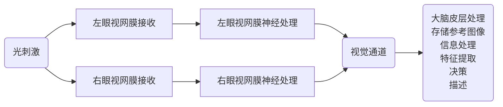

# 第1章 绪论
## 1.1 图像处理的起源
据统计，在人类感知世界的所有信息中，视觉信息占60%，听觉信息占20%，其他信息(如味觉、触觉、嗅觉信息)总计占20%。俗话“百闻不如一见”。
## 1.2 图像的基本概念
一张图可以定义为一个二维函数f(x,y)，其中，x和y为2D空间XY中一个坐标点的位置。    
把连续的图像f(x,y)在2D空间XY和性质空间F都离散化，这种离散化了的图像称为数字图像，可以用I(r,c)来表示，其中，(r,c)为离散后的(x,y),    
r为图像的行(row),c为图像的列(column);      
f(x,y)表示数字图像，f、x和y都在整数集合中取值。对于数字图像来说，车辆的反光镜只是一个数值矩阵。    
数字图像的表达方式：点方式、块方式和值方式。    
## 1.3 图像处理技术分类
1. 模拟图像处理
> 模拟图像处理包括光学处理(通常利用透镜实现)和电子处理，例如，照相、遥感图像处理、电视信息处理等。
> 电视图像是模拟信号处理的典型例子，处理的是活动图像，每秒25帧。
> 模拟图像处理的优点是速度快，一般为实时处理，理论上可达到光速，可实现并行处理；缺点是精度较差，灵活性差，很难有非线性处理能力和判断能力。
2. 数字图像处理
> 数字图像处理采用计算机或专用硬件进行。
> 优点是处理精度高，处理内容丰富，可进行复杂的非线性处理；缺点是处理速度较慢，尤其针对大数据量的复杂处理更是如此。
## 1.4 数字图像处理
特点：
1. 数据量大。灰度1B(Byte)存储，256x256的灰度图像大小64KB(256x256x1B), 256x256的真彩图像大小192KB(256x256x3B)
2. 处理技术综合性强。涉及通信技术、计算机技术、电子技术、电视技术、涉及的数学、物理等方面的基础知识更多。图像处理技术与通信技术密切相关，把通信的一维问题推广到二维以便于分析。
3. 图像信息理论与通信理论密切相关。图像信息论属于信息论科学中的一个分支。通信研究的是一维问题，图像研究的是二维空间信息。通信理论研究的是时间域和频率域的问题，图像理论研究的是空间域和空间频率域之间的关系。

数字图像处理方法：
1. 空域法
空域法把图像看作空间域平面各个像素组成的集合，用二维函数来表示，直接对二维函数进行相应处理。空间域主要包括点处理法和领域处理法。
点处理法包括**灰度处理**，**面积**、**周长**、**体积**、**重心运算**等。
领域处理法包括**梯度运算**、**拉普拉斯算子运算**、**平滑算子运算**、**卷积运算**等。    
2. 频域法
首先采用图像变换的正变换方法，将图像从空域变换到频域，然后利用频域的特殊性质对图像进行处理，最后采用图像变换的反变换方法，将图像从频域变换回空域。
频域法包括**低通滤波**、**高通滤波**等

数字图像处理系统: 采集、处理和分析、显示、存储、通信五大模块。    
处理和分析模块主要用于图像的处理和分析。常用的图像处理和分析技术包括：
- 几何处理
- 算术处理
- 图像增强
- 图像复原
- 图像重建
- 图像编码
- 图像识别
- 图像理解

**(1) 几何处理**：
- 几何变换
- 图像的移动
- 旋转
- 放大
- 缩小
- 镜像
- 多个图像配准
- 全景畸变校正
- 扭曲校正
- 周长计算
- 面积计算
- 体积计算

**(2) 算术处理**:
- 加
- 减
- 乘
- 除
- 与
- 或
- 异或

**(3) 图像增强**: 突出感兴趣的信息，减弱或消除不需要的信息，从而使有用信息得到加强

**(4) 图像复原**: 主要目的是消除干扰和模糊，恢复图像的原始状态 

**(5) 图像重建**: CT技术，X光，超声CT，核磁共振等

**(6) 图像编码**: 信息论中的信源编码范畴，主要是研究数据压缩，解决图像数据量与存储空间消耗之间的矛盾

**(7) 图像识别**: 统计识别法(特征)、句法结构识别法(侧重于结构和基元)和模糊识别法(模糊数学的概念和理论应用于识别处理)。    
图像识别是当前图像大数据、人工智能、深度学习等技术的重要应用领域。

**(8) 图像理解**: 在图像识别基础上的智力表现，是实现人工智能的重要方面。输入为图像，输出为一种描述。    
显示模块主要用于显示图像，常用的图像显示技术包括软拷贝和硬拷贝。    
软拷贝：包括CRT显示、液晶显示器(LCD)、彩色等离子显示技术(PDP)、场致发光显示器(FED)、E-Paper(电子纸、数码纸)等。
硬拷贝: 照相、激光拷贝、彩色喷墨打印等。图像打印一般用于输出较低分辨率的图像，近年来也可采用各种热敏、热升级、喷墨和激光打印等设备输出较高分辨率的图像。常用的图像打印技术包括半调输出技术、抖动输出技术等。

数字图像处理的常用应用领域

|学科|应用内容|
|:--:|:--:|
|物理化学|结晶分析、色谱分析、质谱分析、波谱分析、热谱分析等|
|环境保护|水体保护、污染防治、森林防护、植物植被养护等|
|农林水利|植被分布调查、农作物估产、俩去划定、河流分布、水害调查等|
|工业经济|工业探伤、缺陷检测、立体视觉、三维重建、遥操作、机器人等|
|电子商务|身份认证、扫码识别、产品防伪、无人分拣、智能客服等|
|智慧城市|事故预警、应急指挥、犯罪追逃、行为识别、无人超市、虚拟现实等|
|生物医学|远程医疗、细胞分析、X光图像分析、CT图像分析、内窥镜图像分析等|
|遥感测绘|国土调查、自然资源确权、资源勘探、地图绘制、遥感影像、三维重建等|
|海洋气象|鱼群渔业探查、海洋污染监测、卫星云图分析、龙卷风暴分析等|
|交通运输|无人驾驶、交通监控、车牌识别、智能收费、流量监测、交通规划等|
|信息安全|数字水印、信息隐藏、人脸识别、指纹识别、掌纹识别、虹膜识别等|
|军事科技|军事侦查、情报分析、导弹制导、无人机、单兵装备、精确作战等|

# 第2章 图像与视觉系统
## 2.1 视觉过程

1. 光学过程    

$$
\frac{h}{l}=\frac{x}{L}
$$    

式中，h为物体的高度; l为物体距离观察者的距离; L为晶体聚焦中心和视网膜间的距离; x为物体在视网膜上的成像尺寸。
晶状体聚焦中心和视网膜的距离，L的取值范围为 ` 14mm<= L <= 17mm `

3. 化学过程    
决定了成像的亮度和颜色。
锥细胞主要集中在视网膜的中央，数量少(约650万/单眼)，光敏感度低，强光刺激才能引起兴奋。对红绿蓝三种光敏感。
柱细胞分散在视网膜上，数量多(约1.25亿/单眼),对弱光敏感，敏感度是锥细胞的100多倍。一个光量子可引起一个细胞兴奋，5个光量子就可使人眼感觉到一个闪光。

4. 神经处理过程

## 2.2 光度学基本原理
光是一种电磁辐射，研究光的强弱的学科称为光度学。    
在光度学中，衡量光辐射的功率或光辐射量大小的物理量称为光通量，单位是lm(流明)。    

点光源: 当光源的强度足够小，或者距离观察者足够远，以至于眼睛无法分辨其形状时。    
平面角的度量为圆周上的弧长与圆周半径之比，记作 $\alpha$ ,单位是rad(弧度),如式： 

$$
\alpha=\frac{b}{r}
$$

式中， $\alpha$ 为平面角的弧度; b为圆周上的弧长; r为圆周半径。    
立体角的度量为以立体角的顶点为球心的球面上截出的部分面积与球面半径的平方之比，记作 $\Omega$ ,单位是sr(球面度)，如式：

$$
\Omega=\frac{A}{r^2}
$$

式中，$\Omega$ 为立体角的球面度; A为以立体角的顶点为球心的球面上截出的部分面积; r为球面半径。 

点光源的发光强度定义为点光源Q沿某方向r上单位立体角内发出的光通量，记为l，单位是cd(坎[德拉])，如式：

$$
I=\frac{\Phi}{\Omega}
$$

式中，I为发光强度; $\Phi$ 为光通量; $\Omega$ 为立体角, 由此可见, 1cd=1lm/sr。 从物理意义上来说，
1cd表示“全辐射体”加温到铂的熔点(2024k)时从 $1cm^2$ 表面面积上发出的光的 $\frac{1}{60}$。 所谓“全辐射体”就是某一物质
加热到某一温度时，它发出的能量分布在整个可见光范围内，理论上“全辐射体”就是一个完全黑体，当冷却后，它将吸收所有入射到它上面的光。
由此可知，光通量 $\Phi$ 也可以理解为每秒钟内光流量的度量，即1lm表示与1cd的光源相距单位距离，并与入射光垂直的单位面积上每秒流经的光流量。

例如 试求光通量为2000ml的点光源的发光强度
解： 点光源的发光强度为

$$
I=\frac{\Phi}{\Omega}=\frac{\Phi}{\frac{4\pi r^2}{r^2}}=\frac{\Phi}{4\pi}
$$

因此，光通量为2000lm的点光源的发光强度为

$$
I=\frac{\Phi}{4\pi}=\frac{2000}{4 \times 3.14}=159.24(cd)
$$

