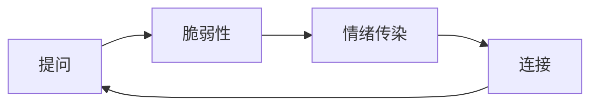

沟通的本质在与建立连接、保持同步。    
匹配原则：即有效的沟通需要我们识别正在进行的对话类型，并以此做出调整，互相匹配。    
简言之，如果对方情绪化，那么你也要流露出自己的情绪；如果对方正在专心致志地思考决策，那么你也应该步调一致地跟上节奏。如果对方关注的是社会影响，那么你应该也据此予以回应。    
沟通：务实对话、情感对话与社交对话。    
确定沟通原则的最佳方式就是不断地尝试不同的交流方式，并留意对方的反应。但无论采取什么方式，其目的只有一个：通过探索来找到对话前进的路径。      
“这究竟是关于什么的”对话本质上是一场协商谈判，只不过它的目的不在于赢，而在于帮助参与者就讨论的主题以及如何共同做出决策达成共识。    

哈佛大学一项研究表明，让参与者在对话开始前，简单罗列出自己想要讨论的话题。这个过程大概只需要30秒。不过，有意思的是，他们写下来的话题往往在讨论开始后并未被提及。    
研究人员发现，即使这些事先列出的话题在对话中未被提及，简单的罗列依然有助于对话的顺畅进行。    
对话开始后，出现尴尬沉默的情况减少了，参与者的焦虑感也有所降低，而且人们在对话结束时会感到自己比以往更投入了。    
因此，在对话开始之前，请让自己简单地思考以下几个问题：
- 你可能会谈及哪俩个话题？
- 你希望谈论哪件事？
- 你想要问哪个问题？

一旦形成习惯，准备工作将会更加充分，同时对你更有帮助：
* 你最希望讨论哪俩个话题？
* 你打算说什么来表明你想要讨论的主题？
* 你会用哪个问题来弄清楚他人的想法？

如果希望对方先开口，最简单的方法就是提出开放性问题：
* 询问对方的信念或价值观
* 邀请对方做出判断
* 询问对方的经历
这些问题既不会显得突兀，也不具有侵犯性。开放性问题可以很轻松，也可以很深刻。

沟通不仅仅是听，是这个人所传递出的所有信号。

当你向别人敞开心扉时，别人自然会对你产生兴趣。

换位思考不是有效的方法。     
询问他们的生活、感受、希望和恐惧，倾听他们的挣扎、失望、喜悦与梦想。    
倾听一个人讲述自己情感生活的重要性在于，当我们谈论情感时，我们不只是在叙述具体发生的事情，更是在阐释我们为何做出某些特定的选择，以及我们是如何理解这个世界的。     

快速交友程序问题：
1. 如果可以选择世界上的任何人，你想邀请谁共进晚餐？
2. 你想要成名吗？如果想，你希望以什么样的方式成名？
3. 打电话前，你会预先排练要说的话吗？为什么？
4. 对你来说，完美的一天是怎样的？
5. 你最后一次对自己唱歌是什么时候？对别人呢？
6. 如果你能活到99岁，并在30岁之后一直保持30岁的心智或身体，你会选择哪一个？
7. 你是否对自己的死亡方式有预感？
8. 说出你与对面这个人的3个共同点。
9. 在你的生活中，你最感激的是什么？
10. 如果你能改变自己成长过程中的任何一个方面，你会改变什么？
11. 请在4分钟内尽可能详细地向你的伙伴讲述你的生活故事。
12. 如果明天醒来，你能获得任何一种品质或能力，那会是什么？
13. 如果一颗水晶球能告诉你关于你自己、你的生活、未来或其他任何事情的真相，你想知道什么？
14. 有没有你长期以来梦想要做的事情？为什么没有去做？
15. 你一生中最大的成就是什么？
16. 在友情中，你最看重的是什么？
17. 你最珍贵的回忆是什么？
18. 你最糟糕的回忆是什么？
19. 如果你知道自己将在一年之内去世，你会改变当前的生活方式吗？为什么？
20. 友谊对你意味着什么？
21. 爱和情感在你的生活中扮演着什么样的角色？
22. 与对面的人分享你认为一个好的恋爱对象应该具备的5个品质。
23. 你的家庭关系亲密且温暖吗？你的童年是否比大多数人幸福？
24. 你觉得你和母亲的关系如何？
25. 每人做3个以“我们”开头的真实陈述。例如，“我们都在这个房间里感到......”。
26. 完成这句话：“我希望有人能和我分享......”。
27. 如果你与对面的人成为亲密朋友，请和对方分享你认为重要的事情。
28. 告诉对面的人你喜欢他/她哪一点(请务必城市，说出你可能不会对刚认识的人说的话)。
29. 与你对面的人分享一件让你感到尴尬的事情。
30. 你最后一次在别人面前哭泣是什么时候？独自一人的时候呢？
31. 告诉你对面的人你喜欢他们身上的什么特点。
32. 有没有什么事情是严肃到不能开玩笑的？
33. 如果你今晚将要去世且没有机会与任何人联系，你最遗憾没有告诉谁什么事情？为什么你还没告诉他们？
34. 如果你的房子着火了，里面有你所有的东西。确保救出你所爱的人和宠物之后，如果你还有时间安全地返回一次，你会想救什么？为什么？
35. 在你的家庭成员中，谁的去世让你最为悲痛？为什么？
36. 分享一个你的个人问题，并询问你对面的人会如何处理这个问题。同时，让对方告诉你，他/她对你提出的这个问题有什么感受。

建立亲密感不仅仅依赖于自我表露，有回应和互惠也起着关键作用。互惠的原则并非立即回应，而是针对彼此的需求进行回馈。这种反馈是双向的。

争执因何而起，又是什么推动了冲突升级，以及他们各自对冲突本身做何解释。需要共同探索是否存在达成共识的部分。     
如何才能达到这种相互理解？      
要认识到每一场争执通常不只涉及一个层面的冲突，导致意见不合的表面问题，以及隐藏在表象下的情感问题。最关键的是，每个人都想赢，证明自己才是对的。    
解决问题的关键在于如何通过情感表达，开启一场“我们的感受如何”的对话，让双方都有机会说出那些可能导致冲突升级的心理伤害和怀疑。     
许多冲突持续存在的根本原因：并非因为缺乏解决方案或人们不愿意妥协，而是因为发生冲突的双方并不清楚冲突的根源所在。      

在冲突中，我们通过证明自己正在倾听来激发情感。     
证明自己在认真倾听的最佳方法之一，是用自己的话重复刚刚听到的内容，接着询问对方自己的理解是否准确。     延伸书籍 阿曼达·里普利《高度冲突》    

向说话者提问，反思刚刚听到的内容，并向对方确认你的理解是否准确，这种方法通常被称为“理解循环”。可以不断地重复这个过程，直到沟通让所有参与者都感到满意。    
使用这种沟通方式的人通常被称为“更出色的团队成员、更好的顾问”以及“未来合作中更理想的伙伴”。    
总结一下理解循环：提出问题、归纳总结听到的内容、询问对方你的理解是否准确。    

在影响一段浪漫关系成败的诸多因素中，一段关系是否增强了我们对个人幸福的掌控感便是其中之一。    
对夫妻而言，双方对掌控感的争夺是非常自然的现象。它涉及一个人如何平衡自己的需求、欲望、角色和责任。    
然而，在发生冲突时幸福与不幸福的夫妻似乎会以完全不同的方式来处理掌控权的问题。        
不幸福的试图控制对方，幸福的更倾向于控制自己、自己所处的环境以及冲突本身。(自我控制、环境控制、冲突的界限控制)     
幸福的夫妻会放慢吵架的节奏，更多的表现出自我控制和自我意识，也更专注于控制冲突本身。     

